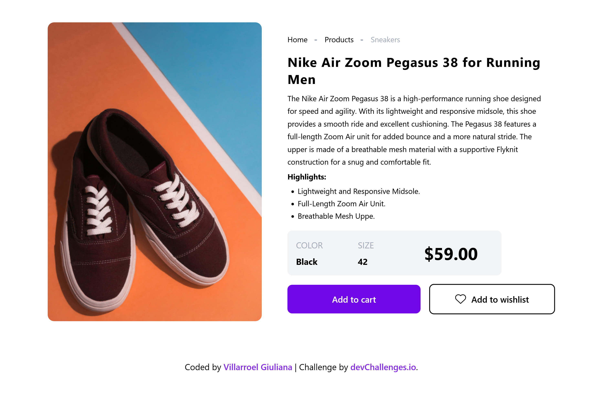

# Running Shoes Product Page | devChallenges

   Solution for a challenge <a href="https://devchallenges.io/challenge/running-shoes-product-page" target="_blank">Running Shoes Product Page</a> from <a href="http://devchallenges.io" target="_blank">devChallenges.io</a>.

  <h3>
    <a href="#">
      Demo
    </a>
     | 
    <a href="https://devchallenges.io/challenge/running-shoes-product-page">
      Challenge
    </a>
  </h3>

## Table of Contents

- [Overview](#overview)
  - [What I learned](#what-i-learned)
- [Built with](#built-with)
- [Features](#features)
- [Acknowledgements](#acknowledgements)
- [Author](#author)

## Overview

I created a complete product page for men's running shoes that mimics the design and functionality of e-commerce websites. The page includes product images, detailed descriptions, featured features, and interactive buttons, all with a clean and modern design.

### What I learned

- **Complex Grid Layouts**: Using CSS Grid to create sophisticated product page layouts.
- **E-commerce UI Patterns**: Understanding how to position and style breadcrumbs, featured products, and call-to-action buttons for optimal user experience.

## Built with

- HTML5 Semantic Structure
- CSS3 Grid Layout System
- CSS3 Flexbox for Component Alignment
- CSS Media Queries
- Mobile-first Design Approach

## Features

- **Complete Product Information**: A well-structured title, detailed description, and notable features inform potential buyers.
- **Complex Grid Layouts**: A sophisticated CSS grid layout organizes product information in an intuitive and visually appealing way.
- **Interactive Elements**: Stylish buttons and hover effects for user interaction.
- **Responsive Design**: The design adapts seamlessly from desktop to mobile devices, maintaining visual appeal and usability.

This [DevChallenges](https://devchallenges.io/challenges-dashboard) project reinforced the importance of grid systems and typography in creating professional e-commerce interfaces.

## Acknowledgements

- [DevChallenges.io](https://devchallenges.io/) for providing realistic design challenges that mirror actual client work
- Modern e-commerce websites for UI/UX inspiration and best practices

## Author

- Website [running shoes product page](#)
- GitHub [@gvillarroel-dev](https://github.com/gvillarroel-dev)